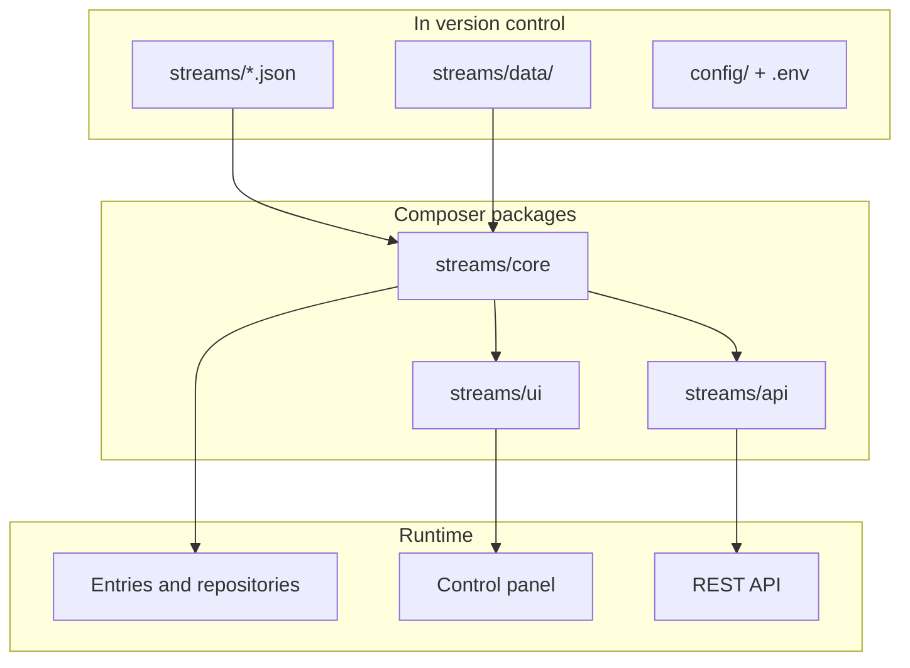

## Overview

A Streams application is a normal Laravel project with additional conventions. Streams does not replace Laravel routing, config, or deployment—it extends them.

## What your team commits

| Path | Purpose |
|------|---------|
| `streams/*.json` | Stream definitions—fields, sources, routes, UI config |
| `streams/data/` | Entry data when using filebase storage |
| `config/streams/` | Published package configuration |
| `app/` | Custom PHP when JSON is not enough |

Environment-specific values stay in `.env`, not in stream JSON.

## Streams Core

Core loads stream definitions, resolves data sources (filebase, Eloquent, collections, remote), and exposes repositories and criteria for querying entries.

Hub guide: [Streams](/docs/streams)  
Reference: [Core documentation](/docs/core/introduction)

## Streams UI

UI builds control panels, forms, tables, and pages from stream and panel configuration. It runs on Livewire and Tailwind—familiar Laravel frontend stack.

Hub guide: [UI](/docs/ui)  
Reference: [UI documentation](/docs/ui/introduction)

## Streams API

API registers REST routes for streams you expose. Response format follows the existing Streams API envelope (see [Responses](/docs/api/responses)).

Hub guide: [API](/docs/api)  
Reference: [API documentation](/docs/api/introduction)

## Composing packages

| Goal | Typical packages |
|------|------------------|
| Data layer only | `streams/core` |
| Admin for your team | `streams/core`, `streams/ui` |
| Headless + admin | `streams/core`, `streams/ui`, `streams/api` |
| Faster scaffolding | Add `streams/sdk` (dev) |
| CI and package tests | Add `streams/testing` (dev) |

See [Use cases](/docs/use-cases) for concrete starting points.
