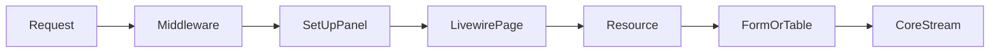

Streams UI follows a Filament-inspired architecture: panels contain resources, resources define pages, and pages host Livewire components that resolve form and table builders.

## Request flow

1. HTTP request hits `/admin/{resource}/...`
2. `SetUpPanel` middleware boots the current panel via `UI::bootCurrentPanel()`
3. Livewire page (`ListEntries`, `CreateEntry`, `EditEntry`) mounts
4. Page delegates to `Resource::table()` or `Resource::form()`
5. Builders query or persist via Core `Streams::entries()`

## Key classes

| Layer | Namespace |
|-------|-----------|
| Panel | `Streams\Ui\Builders\Panels\Panel` |
| Resource | `Streams\Ui\Resources\Resource` |
| Form | `Streams\Ui\Builders\Forms\Form` |
| Table | `Streams\Ui\Builders\Tables\Table` |
| Pages | `Streams\Ui\Livewire\Pages\*` |

## Builders vs Livewire

Builders (`Form`, `Table`, `Action`) are configuration objects. Livewire pages (`InteractsWithForms`, `InteractsWithTable`) bind builder state to HTTP requests.

## Related

- [Panels](/docs/ui/panels)
- [Routing](/docs/ui/routing)
- [Livewire integration](/docs/ui/livewire)
